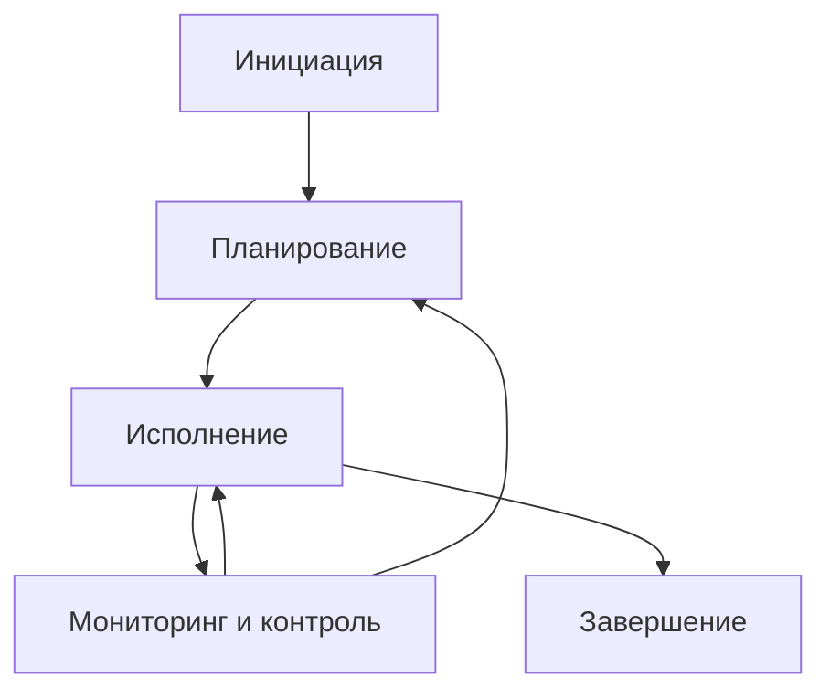
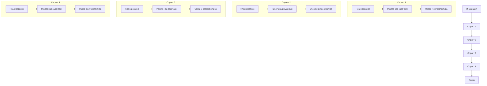
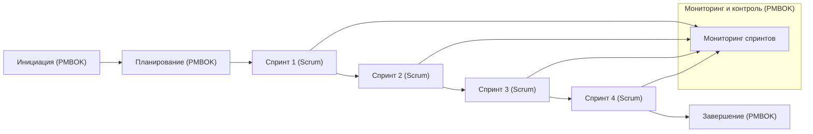

**Определение основных процессов и функций управления проектом согласно PMBOK и ScrumBOK для проекта «Сервис интеграции дополнительных источников документов в Поиск Яндекс Маркета»**

---

### **Шаги проекта**

**Аналитика:**

- Обучение модели **Userbody KNN**
- Обучение модели **Mixigen**

**Разработка:**

- Разработка кода для переноса исходного источника
- Поднятие сервиса
- Настройка доставки данных
- Разработка кода для использования моделей в сервисе
- Интеграция сервиса кандидатогенерации в Поиск

---

## **Управление проектом согласно PMBOK**

**Группы процессов:**

1. **Инициация**
2. **Планирование**
3. **Исполнение**
4. **Мониторинг и контроль**
5. **Завершение**

**Области знаний:**

1. Управление интеграцией проекта
2. Управление содержанием проекта
3. Управление расписанием проекта
4. Управление стоимостью проекта
5. Управление качеством проекта
6. Управление ресурсами проекта
7. Управление коммуникациями проекта
8. Управление рисками проекта
9. Управление закупками проекта
10. Управление заинтересованными сторонами проекта

### **Применение PMBOK к проекту**

**Инициация:**

- Определение целей проекта
- Идентификация заинтересованных сторон

**Планирование:**

- Разработка плана управления проектом
- Определение объема работ, расписания и бюджета
- Планирование ресурсов, качества, рисков и коммуникаций

**Исполнение:**

- Обучение моделей
- Разработка кода и сервисов
- Интеграция сервиса в Поиск

**Мониторинг и контроль:**

- Отслеживание прогресса
- Контроль качества и управления рисками
- Управление изменениями

**Завершение:**

- Финальное тестирование и внедрение
- Документирование результатов
- Официальное закрытие проекта

### **Схема процессов PMBOK**

---

## **Управление проектом согласно ScrumBOK**

**Основные компоненты Scrum:**

- **Роли:**
  - **Product Owner**
  - **Scrum Master**
  - **Development Team**

- **События:**
  - **Sprint**
  - **Sprint Planning**
  - **Daily Scrum**
  - **Sprint Review**
  - **Sprint Retrospective**

- **Артефакты:**
  - **Product Backlog**
  - **Sprint Backlog**
  - **Increment**

### **Применение Scrum к проекту**

**Инициация:**

- Назначение ролей
- Создание **Product Backlog** с задачами проекта

**Спринты:**

**Разбиение задач по спринтам:**

- **Спринт 1:**
  - Обучение модели **Userbody KNN**
  - Разработка кода для переноса источника

- **Спринт 2:**
  - Обучение модели **Mixigen**
  - Поднятие сервиса

- **Спринт 3:**
  - Настройка доставки данных
  - Разработка кода для использования **Userbody KNN** в сервисе

- **Спринт 4:**
  - Разработка кода для **Mixigen**
  - Интеграция сервиса в Поиск

---

## **Функции управления проектом**

### **В PMBOK:**

- **Управление интеграцией**
- **Управление содержанием**
- **Управление расписанием**
- **Управление стоимостью**
- **Управление качеством**
- **Управление ресурсами**
- **Управление коммуникациями**
- **Управление рисками**
- **Управление закупками**
- **Управление заинтересованными сторонами**

### **В Scrum:**

- **Управление бэклогом продукта**
- **Планирование спринтов**
- **Ежедневные Scrum-встречи**
- **Обзор и ретроспектива**
- **Управление качеством и рисками через итерации**

---

## **Интегрированная схема управления проектом**

