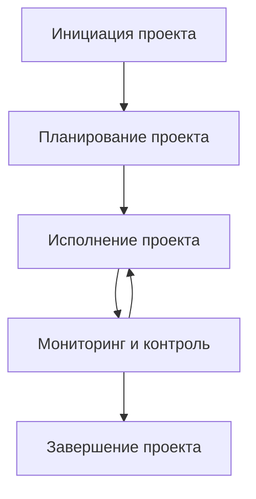
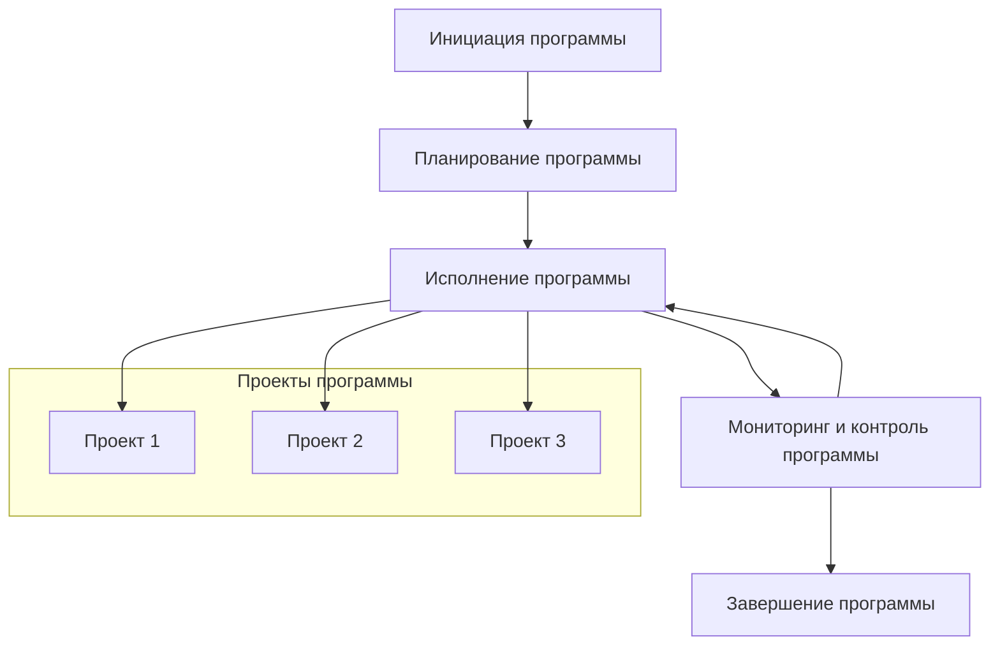
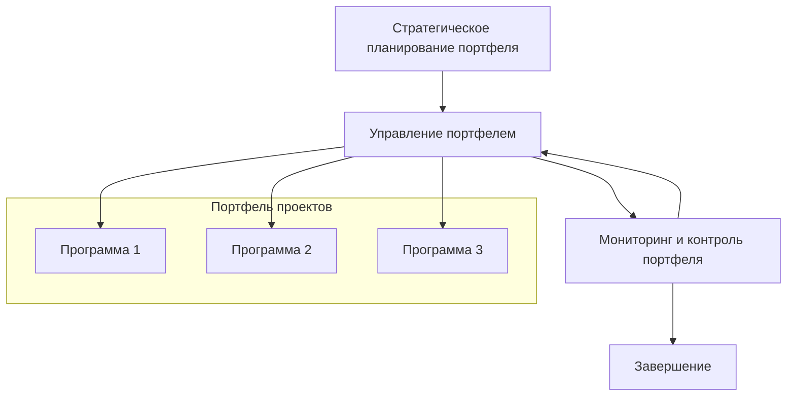

**Определение основных процессов и функций управления проектом «Сервис интеграции дополнительных источников документов в Поиск Яндекс Маркета»**

---

## Уровень проекта

### Основные процессы управления проектом:

1. **Инициация проекта**
   - Определение целей проекта
   - Идентификация заинтересованных сторон
   - Формирование устава проекта

2. **Планирование проекта**
   - Определение объема работ
   - Составление расписания
   - Оценка ресурсов и бюджетирования
   - Управление рисками

3. **Исполнение проекта**
   - Выполнение работ по аналитике
     - Обучение модели Userbody KNN
     - Обучение модели Mixigen
   - Выполнение работ по разработке
     - Разработка исходного кода для переноса исходного источника
     - Поднятие сервиса
     - Настройка доставки данных
     - Интеграция моделей в сервис
     - Интегрирование сервиса кандидатогенерации в сервис Поиска

4. **Мониторинг и контроль**
   - Отслеживание прогресса
   - Управление изменениями
   - Обеспечение качества
   - Управление рисками в процессе исполнения

5. **Завершение проекта**
   - Формальное закрытие проекта
   - Подведение итогов
   - Документирование полученных знаний

### Диаграмма процессов уровня проекта

---

## Уровень программы

### Основные процессы управления программой:

1. **Инициация программы**
   - Определение стратегических целей
   - Выбор проектов для включения в программу

2. **Планирование программы**
   - Планирование интеграции проектов
   - Управление зависимостями между проектами
   - Оптимизация использования ресурсов

3. **Исполнение программы**
   - Координация исполнения проектов
   - Управление общими ресурсами
   - Обеспечение коммуникаций между проектами

4. **Мониторинг и контроль программы**
   - Отслеживание выполнения программы
   - Управление рисками на уровне программы
   - Обеспечение совокупного качества

5. **Завершение программы**
   - Оценка достижения стратегических целей
   - Распространение результатов программы

### Диаграмма процессов уровня программы

---

## Уровень портфеля проектов

### Основные процессы управления портфелем проектов:

1. **Стратегическое планирование портфеля**
   - Определение бизнес-целей
   - Формирование критериев отбора проектов и программ

2. **Управление портфелем**
   - Отбор и приоритизация проектов и программ
   - Распределение ресурсов между проектами и программами
   - Балансировка портфеля по рискам и доходности

3. **Мониторинг и контроль портфеля**
   - Отслеживание совокупной эффективности
   - Корректировка состава портфеля
   - Управление рисками на уровне портфеля

4. **Завершение**
   - Оценка результативности портфеля
   - Адаптация стратегий на основе полученных данных

### Диаграмма процессов уровня портфеля проектов

---

## Заключение

Таким образом, на каждом уровне управления — проект, программа, портфель проектов — существуют свои специфические процессы и функции управления, которые обеспечивают достижение поставленных целей и соответствие стратегическим направлениям организации. Диаграммы, представленные в формате Mermaid, визуализируют эти процессы и показывают взаимосвязи между ними.

