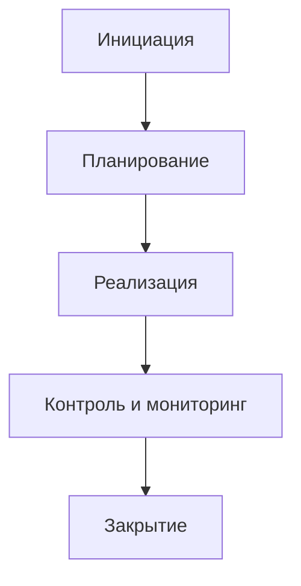
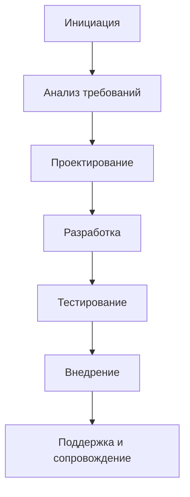
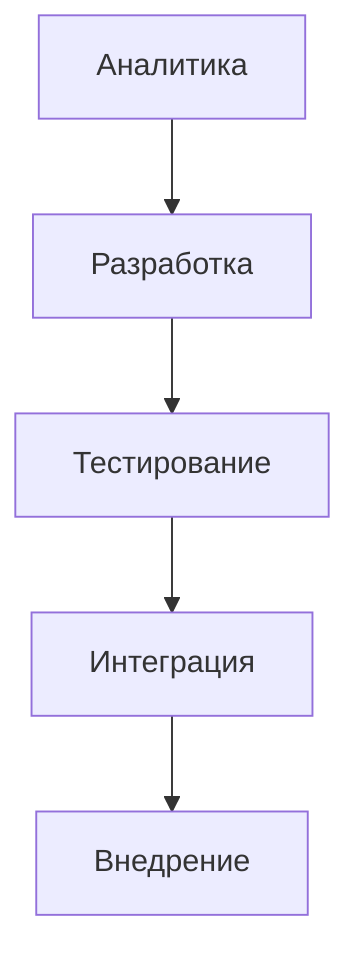

**Схема жихненного цикла проекта «Сервис интеграции дополнительных источников документов в Поиск Яндекс Маркета»**

---

#### 1. **Схема типового жизненного цикла проекта**
  

Типовой жизненный цикл проекта включает следующие этапы:  
- **Инициация**: Формирование идеи, оценка её целесообразности, определение цели проекта.
- **Планирование**: Создание плана выполнения, определение ресурсов, бюджета и рисков.
- **Реализация**: Выполнение задач проекта, использование выделенных ресурсов.
- **Контроль и мониторинг**: Отслеживание выполнения проекта, корректировка плана при необходимости.
- **Закрытие**: Завершение проекта, подведение итогов, фиксация результатов.

---

#### 2. **Схема жизненного цикла программного проекта**

Для программного проекта жизненный цикл учитывает как процесс разработки программного обеспечения, так и его тестирование и внедрение.

Этапы жизненного цикла программного проекта:  
- **Инициация**: Понимание потребностей, постановка целей проекта.  
- **Анализ требований**: Сбор и документирование требований.  
- **Проектирование**: Архитектура и дизайн технического решения.  
- **Разработка**: Программирование (написание кода).  
- **Тестирование**: Проверка работоспособности, выявление ошибок.  
- **Внедрение**: Запуск ПО в работу, выкладка на продакшн.  
- **Поддержка и сопровождение**: Устранение ошибок, доработка функций.

---

#### 3. **Жизненный цикл проекта "Сервис интеграции дополнительных источников документов в Поиск “Яндекс Маркета”**

##### Этапы проекта:
- **Аналитика**:
  - Обучение модели `Userbody KNN`.
  - Обучение модели `Mixigen`.
  
- **Разработка**:
  - Разработка исходного кода для переноса исходного источника.
  - Поднятие сервиса.
  - Настройка доставки данных, необходимых на сервисе.
  - Разработка исходного кода для использования модели `Userbody KNN` в сервисе.
  - Разработка исходного кода для использования модели `Mixigen` для замешивания документов.

- **Тестирование**:
  - Проверка всех разработанных решений на соответствие требованиям, выявление ошибок.  

- **Интеграция**:
  - Интегрирование сервиса кандидатогенерации в сервис Поиска.

- **Внедрение**:
  - Финальный запуск сервиса в эксплуатацию.

---

#### 4. **Сравнение схем и выводы**

| **Типовой жизненный цикл проекта** | **Жизненный цикл программного проекта**                                    | **Жизненный цикл проекта “Яндекс Маркета”**                           |
|-------------------------------------|----------------------------------------------------------------------------|------------------------------------------------------------------------|
| Общая модель подхода к проекту      | Более детализированный процесс, заточенный под разработку ПО.             | Подробные этапы разработки системы и интеграции технологий в сервис.  |
| Универсален для всех типов проектов.| Конкретно описан процесс разработки программного обеспечения.             | Учитаны особенности обучения моделей и их интеграции.                 |
| Включает контроль и мониторинг      | Включает поддержку готового решения после разработки.                     | Сосредоточен на аналитике и разработке, с упором на интеграцию.       |
  
##### Выводы:
- Типовой жизненный цикл является общим для всех типов проектов, он задаёт основу.
- Жизненный цикл программного проекта глубже детализирован и подходит для проектов по разработке и сопровождению программных продуктов.
- Жизненный цикл сервиса "Яндекс Маркет" строится на программном подходе, но дополнен этапами, связанными с аналитикой, обучением моделей и интеграцией сервисов.

