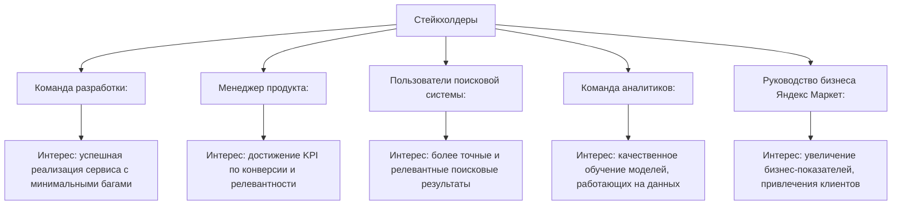
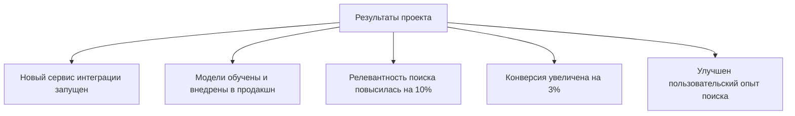

**Устав проекта «Сервис интеграции дополнительных источников документов в Поиск Яндекс Маркета»**

---
### 1. **Цель проекта по SMART**

**Цель проекта:**  
Разработать и внедрить сервис интеграции дополнительных источников документов на основе моделей Userbody KNN и Mixigen в Поиск "Яндекс Маркета", который позволит улучшить релевантность поисковых результатов и повысить точность ранжирования документов.  

**Декомпозиция SMART:**  
- **S (Specific — Конкретность):** Проект направлен на создание сервиса, интеграцию дополнительных источников документов и обучение моделей Userbody KNN, Mixigen.  
- **M (Measurable — Измеримость):** Успешность проекта определяется следующими метриками:  
  - +10%-ное повышение релевантности на тестовых пользовательских сессиях.  
  - Увеличение конверсии пользователей в клики на релевантные результаты на 3%.  
- **A (Achievable — Достижимость):** Задачи выполнимы при слаженной работе команды разработки и аналитиков.  
- **R (Relevant — Актуальность):** Проект имеет высокую значимость, так как улучшение качества поиска помогает бизнесу Яндекс Маркета и увеличивает вовлечённость клиентов.  
- **T (Time-bound — Ограниченность по времени):** Реализация основных этапов проекта должна быть завершена в течение 6 месяцев.  

---

### 2. **Границы проекта**

| **Входит в проект**                                  | **Не входит в проект**                                      |
|-----------------------------------------------------|------------------------------------------------------------|
| Разработка и обучение моделей Userbody KNN, Mixigen | Разработка других ML-моделей и инструментов                |
| Настройка процесса доставки данных в сервис         | Расширение хранения данных в текущих базах                 |
| Интеграция нового сервиса с существующим поиском    | Обновление архитектуры всех подсистем поиска               |
| Повышение точности поиска за счёт новых источников  | Оптимизация общей скорости работы подсистем поиска         |

---

### 3. **Стейкхолдеры и их интересы**

1. **Команда разработки:** за техническую часть внедрения нового сервиса, минимизацию ошибок и соблюдение сроков.  
2. **Менеджер продукта (PM):** отвечает за достижение целевых показателей по метрикам релевантности.  
3. **Пользователи поиска:** заинтересованы в быстром доступе к точной и нужной информации.  
4. **Команда аналитиков:** необходимы данные и алгоритмы для обучения моделей, тестирования.  
5. **Руководство Яндекс Маркета:** заинтересовано в точности поиска, так как это увеличит вовлечённость и продажи.  

---

### 4. **Основные риски проекта**

| **Риск**                                            | **Вероятность** | **Влияние** | **Меры предотвращения**                         |
|-----------------------------------------------------|-----------------|-------------|-------------------------------------------------|
| Сложность интеграции новых моделей в существующую систему поиска | Средняя         | Высокое     | Проведение тех. дизайна и предварительных тестов|
| Недостаток данных для обучения моделей              | Низкая          | Высокое     | Уточнение требований к данным заранее           |
| Замедление работы поиска после интеграции           | Средняя         | Высокое     | Использование тестовых окружений, оптимизация   |
| Возникновение новых багов после внедрения           | Средняя         | Среднее     | Регулярное тестирование и фиксация багов        |
| Несоответствие конечного результата бизнес-ожиданиям| Низкая          | Высокое     | Чёткое согласование требований с бизнесом       |

---

### 5. **Ограничения, допущения**

#### **Ограничения:**  
- Проект должен быть завершён в течение 6 месяцев.  
- Используемый стек инструментов и технологий: Python (для машинного обучения), внутренние API Яндекса.  
- Все работы должны быть синхронизированы с существующими рабочими процессами команды поиска Маркета.  

#### **Допущения:**  
- Пользовательская база данных и дополнительные источники уже готовы для интеграции в систему.  
- Команда обладает всеми необходимыми ресурсами (человеческими и вычислительными).  
- Интеграция модели Mixigen будет основываться на стандартных форматах API.  

---

### 6. **Целевые показатели проекта**

| **Показатель**                     | **Базовое значение** | **Целевое значение** |
|------------------------------------|----------------------|-----------------------|
| Релевантность поиска               | 70%                 | 80%                  |
| Конверсия в клики на выдачу        | 12%                 | 15%                  |
| Время отклика сервиса              | 100 мс               | &lt;100 мс              |
| Количество исправленных ошибок     | -                    | 95%  (до интеграции) |

---

### 7. **Ожидаемые результаты проекта**

1. Успешное внедрение сервиса интеграции дополнительных источников документов.  
2. Обученные модели Userbody KNN и Mixigen, корректно работающие в продакшн-окружении.  
3. Повышение точности и релевантности поисковых запросов пользователей.  
4. Улучшение пользовательского опыта за счёт интеграции нового сервиса в поиск.  
5. Достижение целевых метрик по конверсии, релевантности и быстродействию системы.  

---
