```mermaid
graph TD
    A[1. Проект: Сервис интеграции дополнительных источников в Поиск Яндекс Маркета]
    
    %% Главные этапы
    A --> B[1.1 Аналитика]
    A --> C[1.2 Разработка]
    A --> D[1.3 Тестирование]
    A --> E[1.4 Интеграция и внедрение]

    %% Аналитика (1.1)
    B --> B1[1.1.1 Сбор и анализ требований]
    B --> B2[1.1.2 Обучение модели Userbody KNN]
    B --> B3[1.1.3 Обучение модели Mixigen]

    %% Разработка (1.2)
    C --> C1[1.2.1 Разработка кода]
    C --> C2[1.2.2 Настройка инфраструктуры]
    C --> C3[1.2.3 Поднятие сервиса]
    C --> C4[1.2.4 Работы с моделями]

    %% Подзадачи разработки кода (1.2.1)
    C1 --> C1.1[1.2.1.1 Перенос исходного источника]
    C1 --> C1.2[1.2.1.2 Добавление функциональности в сервис]

    %% Подзадачи настройки инфраструктуры (1.2.2)
    C2 --> C2.1[1.2.2.1 Настройка доставки данных]
    C2 --> C2.2[1.2.2.2 Настройка API для взаимодействия с сервисами]

    %% Подзадачи работы с моделями (1.2.4)
    C4 --> C4.1[1.2.4.1 Интеграция модели Userbody KNN]
    C4 --> C4.2[1.2.4.2 Интеграция модели Mixigen]

    %% Тестирование (1.3)
    D --> D1[1.3.1 Написание тестов для кода]
    D --> D2[1.3.2 Тестирование производительности]
    D --> D3[1.3.3 Исправление ошибок]

    %% Интеграция и внедрение (1.4)
    E --> E1[1.4.1 Интеграция сервиса поиска]
    E --> E2[1.4.2 Тестирование в боевом окружении]
    E --> E3[1.4.3 Документация процесса]
    E --> E4[1.4.4 Внедрение сервиса на продакшн]
```

**Иерархическая структура работ (WBS/ИСР) для проекта «Сервис интеграции дополнительных источников документов в Поиск Яндекс Маркета»**
---

---

### Расшифровка уровней WBS:

1. **1. Проект:**  
   Главная цель — разработать и внедрить сервис.

---

#### **1.1 Аналитика:**  
Этот этап включает в себя проработку всей необходимой информации для построения сервиса и обучения моделей:
- **1.1.1 Сбор и анализ требований:** Понимание данных и их структуры, сбор требований от стейкхолдеров.  
- **1.1.2 Обучение модели Userbody KNN:** Машинное обучение для работы с пользовательскими текстами.  
- **1.1.3 Обучение модели Mixigen:** Генерация текста для смешивания документов.  

---

#### **1.2 Разработка:**  
Центральный этап, включающий создание сервиса, его функций и интеграцию моделей:
- **1.2.1 Разработка кода:** Включает работу со всем исходным кодом для реализуемого функционала:  
  - **1.2.1.1 Перенос исходного источника:** Перенос данных из старых источников в новые.  
  - **1.2.1.2 Добавление функциональности:** Функционал, связанный с работой сервиса.  

- **1.2.2 Настройка инфраструктуры:** Настройка среды выполнения и инфраструктуры сервиса:  
  - **1.2.2.1 Настройка доставки данных:** Настройка потоков для отправки данных в нужные модули сервиса.  
  - **1.2.2.2 Настройка API:** Взаимодействие API сервисов внутри системы.    

- **1.2.3 Поднятие сервиса:** Разворачивание сервиса в тестовом окружении.  
- **1.2.4 Работа с моделями:** Интеграция машинного обучения:  
  - **1.2.4.1 Интеграция Userbody KNN:** Добавление KNN в поиск.  
  - **1.2.4.2 Интеграция Mixigen:** Интеграция Mixigen для замешивания документов.  

---

#### **1.3 Тестирование:**  
Этап проверки корректности работы сервиса:
- **1.3.1 Написание тестов:** Юнит-тесты и модульное тестирование.  
- **1.3.2 Тестирование производительности:** Оптимизация времени отклика на тестовых данных.  
- **1.3.3 Исправление ошибок:** Фиксация найденных багов.  

---

#### **1.4 Интеграция и внедрение:**  
Завершающий этап проекта:
- **1.4.1 Интеграция в поиск:** Встраивание сервиса в основную поисковую систему Яндекс Маркета.  
- **1.4.2 Тестирование в боевом окружении:** Проверка точности и стабильности на реальной системе поиска.  
- **1.4.3 Документация процесса:** Подготовка финальной документации (описание функционала, мануалы).  
- **1.4.4 Внедрение в продакшн:** Ввод сервиса в эксплуатацию.  

---

**Итоговая WBS (ИСР)** представляет полный перечень работ проекта, структурированный по логическим этапам, и поддающийся контролю выполнения по каждому блоку.

